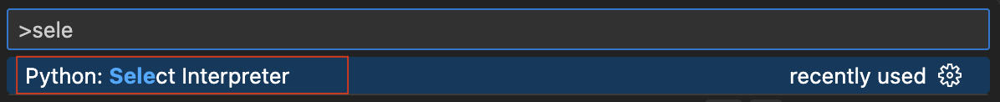
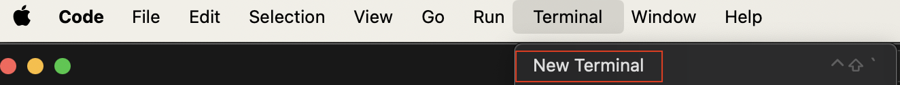
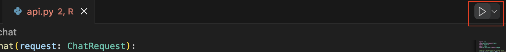

# METCS-633-BU-Agent
An agent fine-tuned for BU Students to ask about career advice and recommended course.

## Table of Contents
- [Problem Statement](#problem-statement)
- [Communication Tools](#communication-tools)
- [Developer's Guide](#developers-guide)
  - [Library](#library)
    - [Python Setup](#python-setup)
    - [UV Install](#uv-install)
  - [Running the Application Locally](#running-the-application-locally)
- [User Guide](#user-guide)
- [Deployment](#deployment)

### Problem Statement
Choosing the right courses and planning a career path can be overwhelming for both prospective and current students at Boston University. With a vast array of programs, concentrations, and extracurricular opportunities, students often struggle to find accurate, relevant, and personalized information to make informed decisions about their academic and professional futures.

While resources exist across university websites, advising offices, and student forums, they are often fragmented, inconsistent, or hard to navigate. This results in missed opportunities, inefficient course planning, and confusion about how academic choices align with career goals.

To address this, our project aims to build an intelligent agent that leverages Gemini to provide real-time, context-aware responses to student inquiries. Whether it's helping a prospective student understand which major suits their interests or guiding a current student on which electives align with a data science career, the agent delivers accurate and accessible advice—bridging the gap between university resources and student needs.

### Communication Tools
1. [Kanban Board: Trello](https://trello.com/b/8BL8NT87/metcs-633-term-project-agent-build)
2. [Document Repo: Google Drive](https://drive.google.com/drive/folders/103rqeI0t7qa6pP23y8ggU1oogcB51kO1)
3. [Team Presentation - WIP](https://docs.google.com/presentation/d/1YoF1kQaw7qZL8LNlL6iU_x2aAXC-SlI90TW813kZzcs/edit?usp=sharing)
3. [Team Assignments / RACI Chart](https://docs.google.com/spreadsheets/d/10zaiso8Lz_lrRvZbwaYB-sGhO7bRAJCRjXSovzsO-QQ/edit?gid=583774764#gid=583774764)
4. [Configuration Item List](https://docs.google.com/spreadsheets/d/10zaiso8Lz_lrRvZbwaYB-sGhO7bRAJCRjXSovzsO-QQ/edit?gid=1380360696#gid=1380360696)
5. [Estimation Record](https://docs.google.com/spreadsheets/d/10zaiso8Lz_lrRvZbwaYB-sGhO7bRAJCRjXSovzsO-QQ/edit?gid=1364674424#gid=1364674424)

## Developer's Guide

### Library 
We're using [uv](https://docs.astral.sh/uv/getting-started/installation/) to manage libraries for our project. To ensure each developer is using the same libraries, follow these instructions.

#### Python Setup
To more easily manage the various versions of Python, we'll be using [pyenv](https://pyenv.net/) to install different versions and select which version to use for our project. At the moment we are using [3.13.3](.python-version).

##### For Macs
1. Open the [Terminal App](https://support.apple.com/guide/terminal/get-started-pht23b129fed/2.14/mac/14.0)

2. Download [Homebrew](https://brew.sh/) if it's not already on your device
    
    <span style="font-size: 11px; font-weight:bold">Copy and paste the command lines below into the Terminal window</span>
    ```
    /bin/bash -c "$(curl -fsSL https://raw.githubusercontent.com/Homebrew/install/HEAD/install.sh)"
    ```
    </span>

3. With Homebrew, install [pyenv](https://github.com/pyenv/pyenv?tab=readme-ov-file#installation)

    <span style="font-size: 11px; font-weight:bold">Copy and paste the command lines below into the Terminal window</span>
    ```
    brew upgrade
    brew install pyenv
    ```

4. Install the python version using pyenv
    
    <span style="font-size: 11px; font-weight:bold">Copy and paste the command lines below into the Terminal window</span>
    ```
    pyenv install 3.13.3
    ```

5. Initialize the newly installed python version for gobal use

    <span style="font-size: 11px; font-weight:bold">Copy and paste the command lines below into the Terminal window</span>
    ```
    pyenv global 3.13.3
    ```
    <span style="font-size: 11px;"><b>Note:</b> You can change your preferred python instance to another version that's installed. See [here](https://realpython.com/intro-to-pyenv/) for more detailed instructions.</span>

6. Proceed to [UV Install](#uv-install)

#### UV Install
We're using [Visual Studio Code](https://code.visualstudio.com/download) as our primary IDE. The instructions below are for creating a virtual environment within the project repo and installing the necessary library packages to run the project locally on your device.

1. Create a Virual Environment within your local copy of the [repo](https://github.com/gaganv007/career_agent)
    
    <span style="font-size: 11px; font-weight:bold">Copy and paste the command lines below into the Terminal window within Visual Studio Code</span>
    ```
    Python -m venv .venv
    ```

2. Select the new virtual environment <i>(.venv)</i> folder as your [Python interpreter](https://code.visualstudio.com/docs/python/environments) 

    

3. Open a [terminal window](https://code.visualstudio.com/docs/terminal/getting-started) within VS Code

    

4. Install [uv](https://docs.astral.sh/uv/getting-started/installation/) under the virtual environment
    
    <span style="font-size: 11px; font-weight:bold">Copy and paste the command lines below into the Terminal window within Visual Studio Code</span>
    ```
    pip install uv
    ```

5. Sync the library packages within your local environment
    
    <span style="font-size: 11px; font-weight:bold">Copy and paste the command lines below into the Terminal window within Visual Studio Code</span>
    ```
    uv sync
    ```

The python libraries within your virtual environment should now include all the dependencies listed in [pyproject.toml](pyproject.toml). 

### Running the Application Locally

1. If you haven't already, create a local '.env' to hold the LLM API Key

    - See [.env_example](.env_example)

2. Run '[api.py](src/api.py)' from Visual Studio Code

    

    - This will create a local web server that runs the agent and processes interactions

3. Open '<a href="src/index.html" target="_blank">index.html</a>' from your preferred web browser

    - This is the front-end application to interact with

## User Guide
🚧 Coming Soon

## Deployment
🚧 Coming Soon
